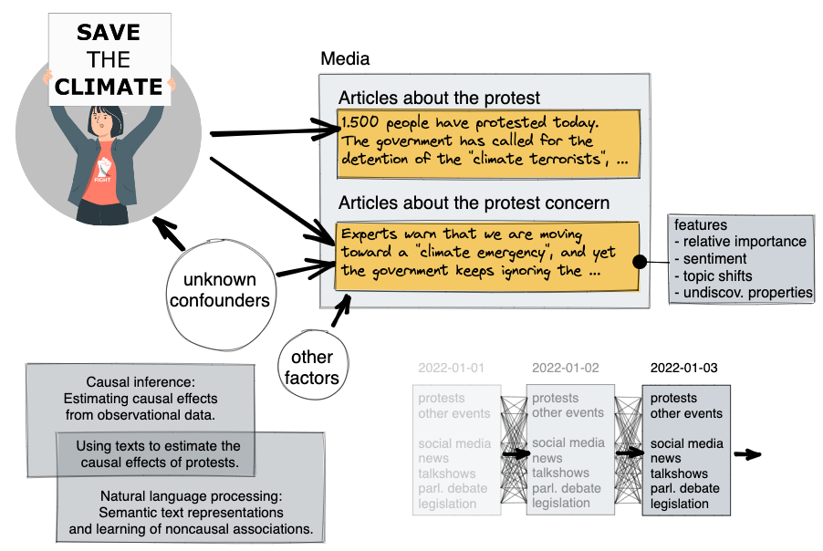

> ### Can we use causal inference and natural language processing to quantify the impact of protest movements on public discourse?

Master thesis project (in progress) by David Pomerenke

## Abstract

Citizens in democracies have an interest in understanding the effectiveness of protest movements, and which factors make them effective. For example, there is currently widespread debate whether radical protest has a positive or negative impact on the goals of the climate movement; and social science does not yet have a conclusive answer.

The ultimate goal of protest is a change in policy, which is hard to quantify. A good proxy may be the effect on public discourse [1], which can be measured through newspaper articles and social media posts, for which we can quantify the amount of coverage on the protest concern, and associated sentiment, polarization, and topicality. However, it is difficult to determine whether a protest event has caused a change in public discourse in the following days or weeks: the change may be due to an external factor, or an external factor may have acted as a confounder that caused both the protest as well as the change in public discourse.

Causal inference can help solving this problem. In my thesis I want to focus on a recent technique that uses natural language processing for removing confounders:

- **Propensity score matching:** Here we make the assumption that all relevant confounders are themselves manifested within newspaper articles. While this assumption will be imperfect, it is reasonable to assume that newspaper reports cover many relevant trigger events and also roughly represent existing trends in public discourse. Then we can train classifiers to predict the likelihood of both protests and features of public discourse for a given day, and then match days with similar predictions to create something similar to a control-group for days with protest events.[2][3][4]

To evaluate the technique, I want to compare it against more established causal inference techniques, such as:

- **Synthetic control group:** Here we focus on a region where a protest occurs on a given day, and try to model the features of public discourse as a weighted average of features from other regions where no protest occurs on the given day. This weighted average is then a synthetic region that serves as a counterfactual for the case that no protest had occurred in the real region, and can be compared with it.[5][6]
- **Instrumental variable:** Here we assume that the weather acts as an independent variables that does not have a direct effect on public discourse regarding the protest concern, but may have an indirect effect through the occurrence and size of protest events. The correlation between weather and features of public discourse can then be used to estimate the effect of protest on public discourse.[7][8][9]

The data for the thesis consists of more than 3.5GB of full-text newspaper articles from 22 diverse German newspapers (national and regional) from 2013-2022. The full-texts have been scraped via metadata provided by MediaCloud.org and Google News. Protest events will be extracted from newspaper articles in accordance with previous research on protest event detection in German cities [10], yielding 2,000-10,000 events per city with an F1-score of 93%.

This research project would (a) contribute to the solution of a relevant societal question in an innovative way and (b) contribute to methodical advances within artificial intelligence by applying, comparing, and possibly enhancing recent techniques between causal inference and natural language processing.

## Research questions

- What is the causal impact of protest occurrences on the importance of the protest concern in public discourse? What is the impact of the various features of the protest (such as size, radicality, and the protest concern) on the various features of public discourse (such as relative importance of the protest concern, sentiment, and polarization)?
- How do the estimates from using different causal inference methods compare to each other, and to a correlational estimate? How robust are the results to the choice of representations and models used for natural language processing?

## Core literature

[1] Ozden, J., & Glover, S. (2022). Protest Outcomes—Final Report. https://www.socialchangelab.org/research

[2] Keith, K., Jensen, D., & O’Connor, B. (2020). Text and Causal Inference: A Review of Using Text to Remove Confounding from Causal Estimates. Proceedings of the 58th Annual Meeting of the Association for Computational Linguistics, 5332–5344. https://doi.org/10.18653/v1/2020.acl-main.474

[3] Feder, A., Keith, K. A., Manzoor, E., Pryzant, R., Sridhar, D., Wood-Doughty, Z., Eisenstein, J., Grimmer, J., Reichart, R., Roberts, M. E., Stewart, B. M., Veitch, V., & Yang, D. (2021). Causal Inference in Natural Language Processing: Estimation, Prediction, Interpretation and Beyond. ArXiv: Computation and Language. https://arxiv.org/abs/2109.00725

[4] Roberts, M. E., Stewart, B. M., & Nielsen, R. A. (2020). Adjusting for Confounding with Text Matching. American Journal of Political Science, 64(4), 887–903. https://doi.org/10.1111/ajps.12526

[5] Abadie, A., Diamond, A., & Hainmueller, J. (2010). Synthetic Control Methods for Comparative Case Studies: Estimating the Effect of California’s Tobacco Control Program. Journal of the American Statistical Association, 105(490), 493–505. https://doi.org/10.1198/jasa.2009.ap08746

[6] Mourtgos, S. M., Adams, I. T., & Nix, J. (2022). Elevated police turnover following the summer of George Floyd protests: A synthetic control study. Criminology & Public Policy, 21(1), 9–33. https://doi.org/10.1111/1745-9133.12556

[7] Huet-Vaughn, E. (2013). Quiet Riot: The Causal Effect of Protest Violence (SSRN Scholarly Paper No. 2331520). https://doi.org/10.2139/ssrn.2331520

[8] Klein Teeselink, B., & Melios, G. (2021). Weather to Protest: The Effect of Black Lives Matter Protests on the 2020 Presidential Election (SSRN Scholarly Paper No. 3809877). https://doi.org/10.2139/ssrn.3809877

[9] Madestam, A., Shoag, D., Veuger, S., & Yanagizawa-Drott, D. (2013). Do Political Protests Matter? Evidence from the Tea Party Movement*. The Quarterly Journal of Economics, 128(4), 1633–1685. https://doi.org/10.1093/qje/qjt021

[10] Wiedemann, G., Dollbaum, J. M., Haunss, S., Daphi, P., & Meier, L. D. (2022). A Generalized Approach to Protest Event Detection in German Local News. Proceedings of the Thirteenth Language Resources and Evaluation Conference, 3883–3891. https://aclanthology.org/2022.lrec-1.413

## Structure

- `data`: Original datasets. Some are protected and will be made available via Zenodo.
- `protest_impact`: Python module with submodules corresponding to the chapters of the report. Each submodule contains functions with shared functionality, and accompanying notebooks that produce tables and figures for the report.
  - `data`: Data loading and processing. Intermediate results are also stored here.
  - `naive`
  - `synthetic_control`
  - `instrumental_variables`
  - `propensity_scores`
  - `results`: Code and data relating to evaluation results.
  - `util`: Helper functions.
- `report`: [Quarto](https://quarto.org/) project with the source for the report. Figures and tables are included from the notebooks within the Python module.

## Usage

This is not to be used yet.

## License

(c) David Pomerenke 2023. (For now.)
