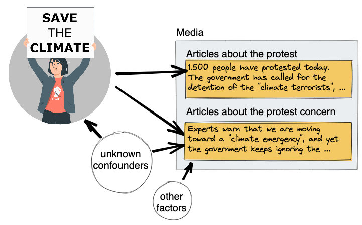

<!--

Product / code runs well without flaws. It is well written and is commented in such a way that an external party can easily extend it.
+ the code contains features that makes it valuable for publishing it in an open source repository  / apply in business use. Some attempt to optimize has been done.
+ the code is highly optimized.

-->
# How do protests shape discourse?
## Causal methods for determining the impact of protest events on newspaper coverage

Master thesis project (in progress) by David Pomerenke

## Abstract

Protests can have an impact on newspaper coverage, not only by prompting reports about the protest events themselves, but also by bringing attention to the issue that they are concerned with. But they may also have negative impacts by distracting from existing constructive discourse on the issue. Quantitative media analyses can uncover these impacts. The problem is that protests and media coverage are in a complex causal relation: They mutually influence each other, and external events may cause both protests and coverage to increase at the same time. To deal with observed and unobserved confounding, I evaluate multiple causal methods: Besides the classical repertoire of regression and instrumental variables, I investigate aggregated synthetic controls and inverse propensity weighting. I show that all methods reduce bias but do not completely remove it, except perhaps the synthetic control method. My analysis of climate protest events in Germany shows that the protests generally tend to increase not only protest-related coverage but also other coverage related to climate change; but there are differences between the various protest groups. This sheds empirical light on a theoretical debate about possible backfiring effects.

## Structure

    ├── data
    │   ├── external       <- Data from third party sources.
    │   ├── interim        <- Intermediate data that has been transformed.
    │   ├── processed      <- The final, canonical data sets for modeling.
    │   └── raw            <- The original, immutable data dump.
    ├── models             <- Trained and serialized models, model predictions, or model summaries
    ├── notebooks          <- Jupyter notebooks.
    ├── pyproject.toml     <- Requirements for installation with [Poetry](https://python-poetry.org/).
    ├── report             <- [Quarto](https://quarto.org/) project with the source for the report.
    └── src                <- Source code for use in this project.
        ├── data
        ├── features
        ├── models
        └── visualization

## License

(c) David Pomerenke 2023. (For now.)
